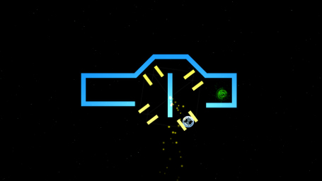
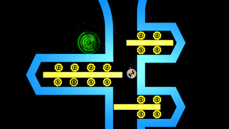
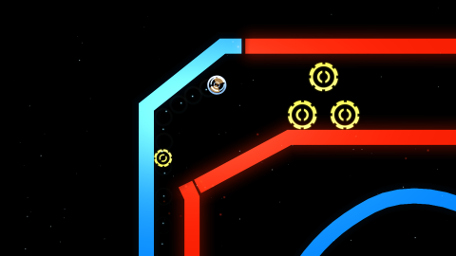
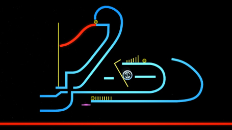
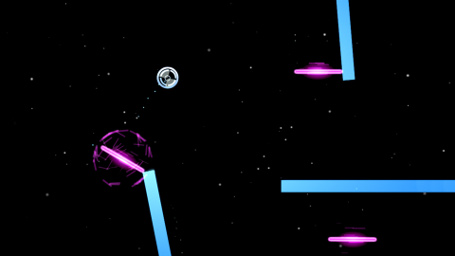
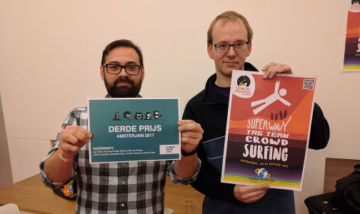

Ever since I started out in this industry I have worked on many projects. Some of those will never see the light of day. Others which I am particularly proud of received a spot on this website. This page lists the impressive or interesting ones among those, and their story.

---

# SpeedRunners

<iframe width="455" height="256" src="https://www.youtube.com/embed/BDGzN0fRQI0" frameborder="0" allowfullscreen></iframe>

Speedrunners is a multiplayer side-scrolling game where you try to run faster than the other guys until they drop off-screen and they explode. It is great fun. It is huge! Trust me. You'll love it!

My contract at DoubleDutch Games was to help them port their game SpeedRunners to the consoles. There are a lot of issues to tackle when porting to these platforms, even when using a reasonably portable game engine like Unity3D. The game has a rather large legacy codebase, being originally created in XNA and later ported to MonoGame and then to Unity.

Personally, I worked on the Fuze and Xbox One ports, adapting existing code or writing new code to integrate with various systems on these platforms. Platform holders are strict about their Technical Requirements Checklists. They require a lot of changes to the game to ensure it interacts with existing systems on the platform and to ensure the game behaves as expected. This involved such things as:

* Application Lifecycle Management  
  *eg. constrain/suspend/resume*
* Active User Management and User Privileges handling  
  *eg. ensure that game state, local game saves, cloud saves and other user data is handled correctly, at all times. This includes many unpredictable situations such as system users being switched out mid-game or a user being forcefully logged out due to remote events, among others.*
* Peer to Peer networking
* Matchmaking
* Voice Chat
* Friends Lists and Presence Management
* Events and Achievements systems within the game, and configuration in the back-end
* Ensuring correct platform and language dependent terms and imagery within the game  
  *eg. for popup notifications or to refer to things like controller buttons*
* Reading messy documentation about above mentioned platform APIs and conventions.
* A huge amount of time bughunting and fixing
  
Sometimes this involved writing translation wrappers around platform specific systems, so that the base game could access them in using a platform independent interface. In many other situations, we were not so lucky and invasive changes in the core of the game were required. From new UI screens to large changes of existing systems.

Porting an existing PC game to consoles can be a huge amount of work. Working on this project has definitely give me more perspective on games ported to/from console not only as developer but also as a gamer.

[SpeedRunners is developed by DoubleDutch Games and published by tinyBuild.](http://www.tinybuild.com/speedrunners)
  
---

# iO
<iframe width="455" height="256" src="https://www.youtube.com/embed/nfQKWwc-op8" frameborder="0" allowfullscreen></iframe>

[iO](http://gamious.com/io) started as a game prototype originally conceived and created by an ad hoc team of me and four others, during the Global Gam Jam of 2012 in Utrecht. Back then it was simply called Size Matters. The publishing company Gamious approached us and told us they wanted to work together with our team to take this game to the next level. What followed was a lengthy development process to expand upon the game with new game mechanics, extra content and to add the features and polishing neccesary for publishing to the major digital game stores.

This took way longer than any of us expected. Most team members had regular daytime jobs, and I was basically the only member working on the project full-time. We were also physically distributed throughout the country, so for communication, we were forced to rely on tools like trello and on schedules meetings over Skype. Keeping the project on track and team members motivated was extremely difficult. The project took too long really, which lead to all kinds of troubles in the development process. Despite these issues, we persevered and launched the game to the mobile stores and Steam and Ouya. I then took some distance from the project in order to recover some sanity points. Gamious eventually also ported and released the game on XBox One and Playstation 4.

iO is a unique mix between platforming, physics puzzles and racing. The simple colorscheme and smooth curves are remniscent of Tron and Sonic the Hedgehog. The music has a zen feeling to it, which is welcoming in the early easy levels, and which will certainly help you to keep your calm in some of the later levels, which can be extremely challenging.

I am rather proud of the game mechanics, which are very simple, yet allow for a ton of depth in the challenges that can be created, as evidenced by the huge number of levels present in the game. The player can provide torque to roll left or right, and he can grow or shrink. Changing size in this manner also influences properties like mass and friction. This allows for many interesting tricks. [Take a look at how I approached iO level design.]()

I am also particularly satisfied with [the level editing tools I created]() within the Unity3D editor by writing custom editor extensions. This allowed even non-technical members of the team to have a hand in creating levels. These tools made it very easy to create and manipulate level geometry using bezier curves, with appropriate triangle meshes and colliders being generated on-the-fly procedurally. Since all of this happened inside the Unity3D scene editor, testing levels was simply a matter of hitting play mode and allowed fast iteration.

[iO is published by Gamious and now available on Steam, Windows Store, Xbox One, Playstation 4, Google Play, and App Store.](http://gamious.com/io)

---

# Other Projects

These projects tend to be small but interesting in some way. **Source code is available.** If you want, you can clone the repo, open it in Unity, and hit play to see the code in action.

---

## NBody Simulation on GPU

An n-body system is a system where many bodies interact with each other. Typically, each particle interacts with every single other particle in the simulation. Simulating and rendering such a system makes for an interesting problem. This project implements an n-body system with gravity on the GPU using compute shaders.

[This project is available on github.](https://github.com/sanderman01/unity-nbody)

---

## Super Wavy Tag Team Crowdsurfing

<iframe width="455" height="256" src="https://www.youtube.com/embed/kdmH_0UMJiM" frameborder="0" allowfullscreen></iframe>

*You finally get to see your favorite band live, you are so close to the stage that you can almost touch them, and then, the singer jumps to surf the waves formed by the hands of his biggest fans, yes that's you! It is your duty... No! it is your DESTINY to carry him as far as possible without dropping him to the ground, for the glory of ROCK!*

A game created recently at the Global Game Jam 2017 in Amsterdam. The theme was Wave, and we settled on the idea of waves in a crowd, such as the crowds at a sports stadium or music concert. In this co-operative 4-player party game you and your friends play the crowd. A rockstar jumps off the stage and it is your job to help him crowdsurf safely and without 'accidents.' It is a very simple game but immensely fun, with lots of potential for hillarity. When playtesters are laughing so hard that it hurts, then you know you've got a fun game.

[Global Game Jam project page](http://globalgamejam.org/2017/games/super-wavy-tag-team-crowd-surfing)  
[This project is available on github.](https://github.com/sanderman01/ggj2017-crowdsurf)

---

## Planet Search

<iframe src="https://player.vimeo.com/video/104621204" width="455" height="256" frameborder="0" webkitallowfullscreen mozallowfullscreen allowfullscreen></iframe>

A game created during the 2014 Pillo Jam. Goal of this game jam was to create game controlled using devices with sensors embedded in real live pillows. This is a 2-player game. Each player controls a single rocket thruster, which will tend to turn the spacecraft to the left or right. Careful coordination is required to fly towards your intended destination. Or you can relax and simply fly around to see where you happen to end up.

[This project is available on Bitbucket](https://bitbucket.org/sanderman/pillojam)

---

## Pathfinding demo

A basic A* pathfinding demonstration. This includes a pseudorandomly generated cloud of nodes, representing a galaxy. Nodes are linked by pathways, similar to the hyperlanes in 4x strategy games such as Stellaris. The user can click on two nodes and a path from one to the other will be calculated and highlighted.

[This project is available on github.](https://github.com/sanderman01/pathfinding-demo)

## Public Space Invaders

<iframe width="455" height="256" src="https://www.youtube.com/embed/XTN57S6kZ7g" frameborder="0" allowfullscreen></iframe>

A game created during the 2012 Games4Health Jam in Eindhoven. Jam goal was to create a game adding extra life to public spaces and to stimulate excercise and movement. We used a top down-camera and computer-vision (OpenCV) to map the locations of players in a large physical area to the locations of player avatars within the game. This allowed for anyone to join in playing the game simply by walking into the play area.